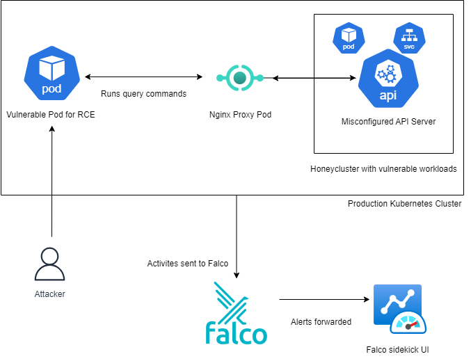

# 🐝 Honeycluster — Kubernetes Honeypot with vcluster, Falco, and NGINX

**Honeycluster** is a lightweight, modular Kubernetes honeypot system that leverages **vcluster** for safe isolation, **Falco** for runtime threat detection, **NGINX** for simulating an exposed Kubernetes API server, and **Falcosidekick** for unified alert forwarding.  

The system is designed to **attract**, **detect**, and **log** malicious activity in a controlled environment — enabling researchers, SOC teams, and security engineers to study attacker behavior without risking production infrastructure.

---

## 📜 Features

- **Deception Through Realism**
  - Simulates a Kubernetes control plane with `vcluster` in a dedicated namespace.
  - Deploys vulnerable workloads and intentionally insecure configurations (e.g., anonymous API access).

- **Runtime Threat Detection**
  - Uses **Falco** to monitor system calls, detect shell spawns, privilege escalation, and suspicious binaries.
  - Includes custom Falco rules tuned for honeypot context.

- **Unified Logging Pipeline**
  - **NGINX reverse proxy** intercepts fake Kubernetes API requests and formats them as JSON logs.
  - Logs and alerts forwarded to **Falcosidekick** and then to webhooks/dashboards.

- **Safe Isolation**
  - Runs inside `minikube` or any Kubernetes cluster.
  - Restricts honeypot namespace network access via NetworkPolicies.

---

## 🛠 Tools and Components

| Component | Purpose |
|-----------|---------|
| [vcluster](https://www.vcluster.com/) | Creates a virtual Kubernetes cluster inside a namespace for isolation |
| [Falco](https://falco.org/) | Syscall-based runtime security detection |
| [Falcosidekick](https://github.com/falcosecurity/falcosidekick) | Forwards Falco alerts to multiple outputs |
| [NGINX](https://nginx.org/) | Simulates exposed Kubernetes API and logs requests |
| [Helm](https://helm.sh/) | Simplified deployments of vcluster, Falco, and Falcosidekick |
| [Minikube](https://minikube.sigs.k8s.io/) | Local Kubernetes cluster for testing |

---

## 🏗 Architecture

Below is the high-level architecture of **Honeycluster**:

## 📦 Deployment Guide

### 1️⃣ Prerequisites
- Kubernetes cluster (Minikube or cloud-based)
- [Helm](https://helm.sh/) installed
- `kubectl` configured

### 2️⃣ Deploy vcluster with Insecure API

` vcluster create honeypot -n honeypot -f vcluster_values_yaml/vcluster-api.yaml `

The values file is deliberately configured with the API server set to [anonymous mode](https://securitylabs.datadoghq.com/cloud-security-atlas/vulnerabilities/unauthenticated-api-server/) misconfig. You can modify values.yaml further to add more misconfigurations.

To deploy the policy for anonymous mode. Currently it allows every request to kube api in anonymous. You can configure accordingly:

` kubectl apply -f vcluster_values_yaml/anonymous-policy.yaml`

### 3️⃣ Deploy Vulnerable Workloads

The `vulnerable_workloads` folder contains some sample vulnerable workloads which you can deploy . You can configure accordingly. To deploy them:

` kubectl apply -f vulnerable_workloads/`

### 4️⃣ Deploy Falco

Deploy falco using the below command. Make sure you're in the context of main cluster and not vCluster:

`helm repo add falcosecurity https://falcosecurity.github.io/charts
helm repo update
helm upgrade --install falco falcosecurity/falco -n default -f falco/values.yaml`

Falco, Falcosidekick and it's UI is deployed in default namespace. You can view the dashboard of falcosidekick with below command:

`kubectl --context=minikube  port-forward svc/falco-falcosidekick-ui 2802:2802 -n default`

### 5️⃣ Deploy Nginx Config to expose vcluster KubeAPI

This folder contains configurations to setup nginx logging of vcluster KubeAPI. If namsepace of vcluster is honeypot and falco is deployed in default, no changes is needed and it can be directly deployed:

`kubectl --context=minikube apply -f nginx_config/nginx-kube-api.yaml`

If not, please make changes accordingly , the image used is not nginx, rather a custom image pointing to my registry, you can create a custom image, build and deploy accordingly. You can also regenerate the certificates accordingly.

### 6️⃣ Initial Access web application

In my architecture , I have a web application which points to the nginx in /etc/hosts file to trick the attacker into thinking that the nginx endpoint is the KubeAPI endpoint. To configure this, one small change is needed: In the yaml file, change the below:

`ip: "10.101.0.58" `

Change the IP into the nginx service cluster IP

Of course you can deploy whatever you want as initial access and create your own, this is just my deployment.

## 🛠 Configuration Notes

### vcluster:

vcluster_values_yaml/vcluster-api.yaml intentionally enables anonymous API.
Tweak with care; it’s supposed to be insecure here.

### Falco:

Default rules already detect common attacker behaviors (exec, priv‑esc, etc.).
Add custom rules via Helm values or ConfigMap if needed.

### Falcosidekick:

Supports Slack, Teams, Discord, Webhook, InfluxDB, Loki, etc. Configure via values.

### NGINX:

The nginx.conf defines the fake API routes and JSON logging format.
Extend with more endpoints to look “real”.

### Vulnerable workloads:

vulnerable_workloads/ holds intentionally weak deployments. Adjust as you like.

## Screenshots: 

Below is a screenshot of how an attacker would see the fake kube api endpoint once a pod is compromised. The attacker would be tricked into thinking it is the real kube api endpoint and perform port scanning when it is actually the vcluster api endpoint 

Attacker querying and finding the fake secret injected. Thie can be customized as per user requirements.

All logs stored and can be queried in falco sidekick dashboard as shown below:

## 🤝 Contributing

- Fork the repo

- Create a feature branch

- Submit a PR with clear description and testing steps

